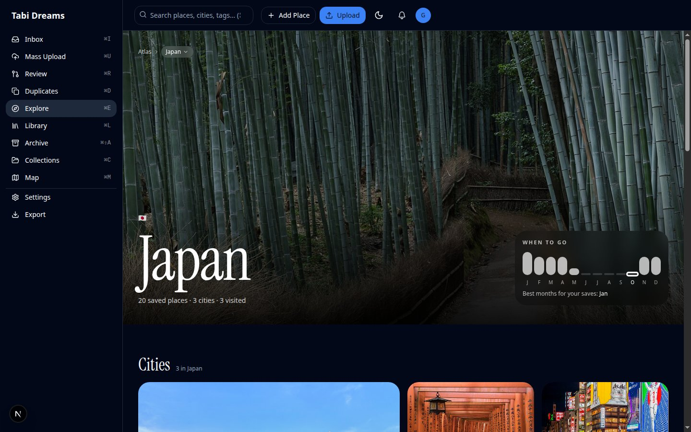
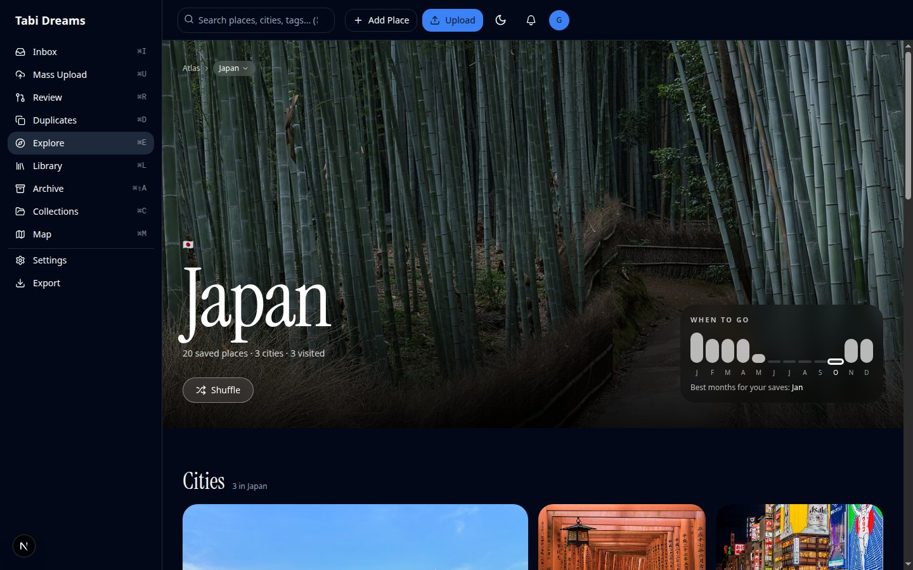
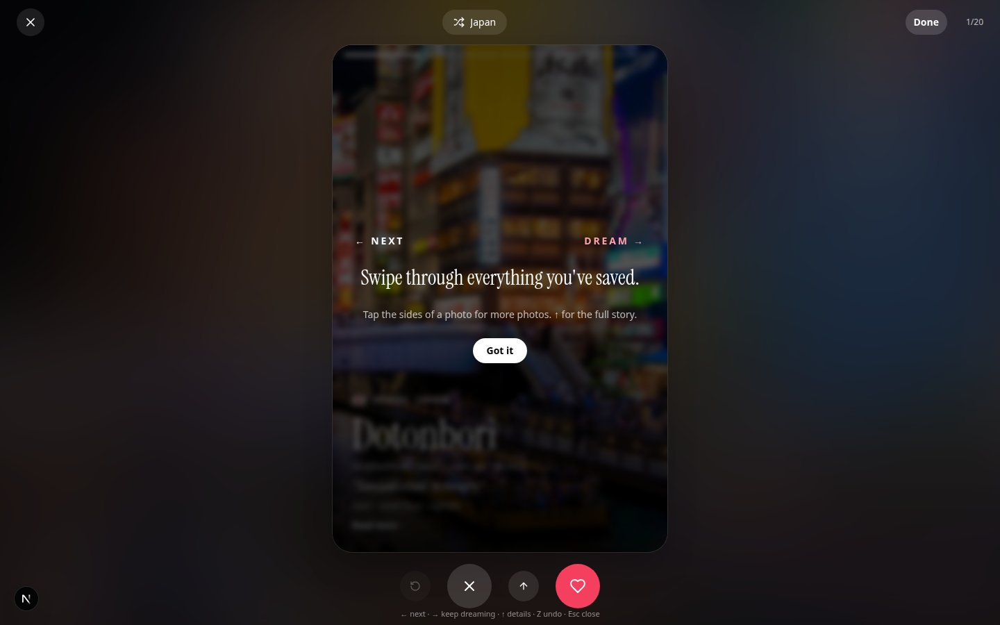
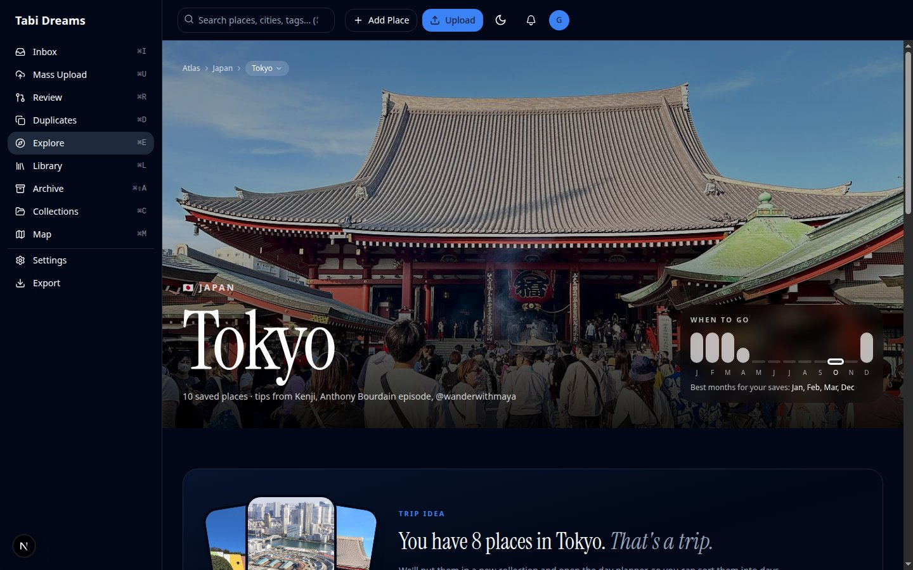
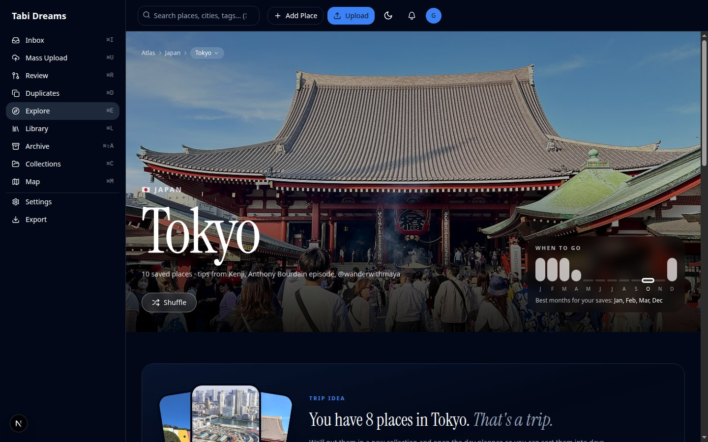
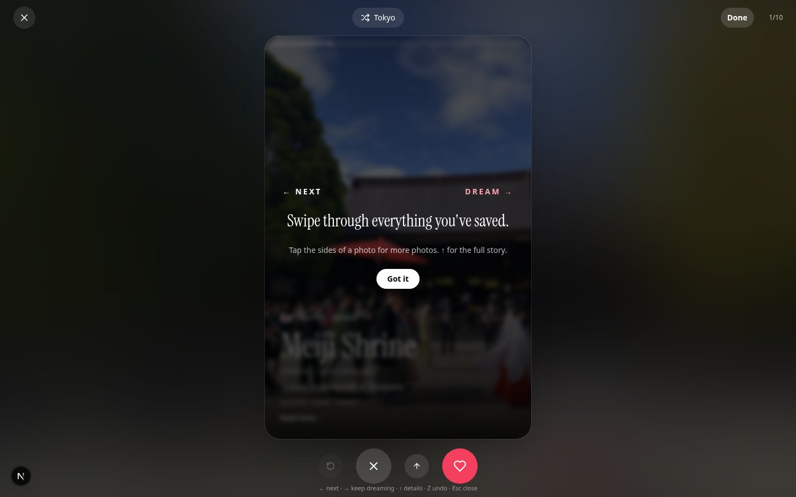

# Atlas scoped Shuffle entry points — evidence

Live captures from headless Chrome (`chrome-devtools-axi`, CDP `:9333`) against `next dev` on
`:3201`, signed in as the local demo user (`explorer@local.test`, SQLite seeded via
`.local-scripts/seed.mjs`). Desktop viewport 1440×900.

| Before (no hero Shuffle link) | After (scoped Shuffle + deck) | What it shows |
|---|---|---|
|  |  | Japan country atlas hero gains a **Shuffle** button styled like Explore home |
|  |  | Country Shuffle opens `/explore/shuffle?country=japan` with a Japan-only deck |
|  |  | Tokyo city hero gains the same **Shuffle** control |
|  |  | City Shuffle opens `?country=japan&city=tokyo` with Tokyo-only places |

**Exercised live in the browser:** clicking **Shuffle** on `/explore/atlas/japan` and on
`/explore/atlas/japan/tokyo`, confirming the full-screen deck loads with the scoped title and
back link to the atlas page.

**Covered by unit tests:** `shufflePool` country-only and country+city slug filtering in
`src/__tests__/explore/shuffle.test.ts`.
