# Explore home and row pages — evidence

Live captures from headless Chrome against `next dev` on `:3417`, signed in as a local
demo user whose places live in a local SQLite file (133 places, 29 countries, 68 cities).
Desktop is 1440×900; phone is 390×844 at 2× DPR. "Before" is `main` at `39897ef`, which has
no Explore route.

| Before (`main`) | After (this branch) | What it shows |
|---|---|---|
| 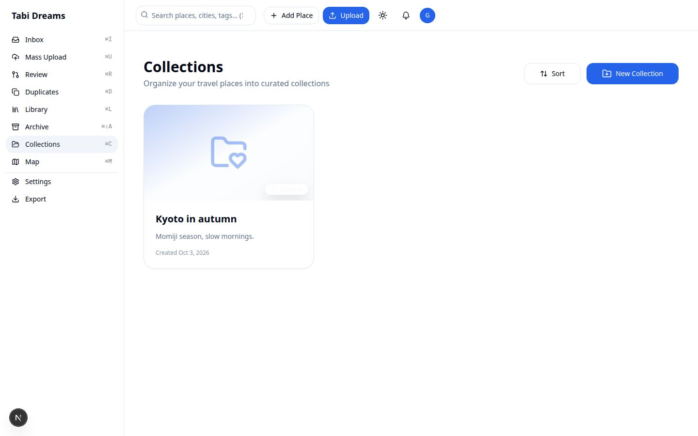 | 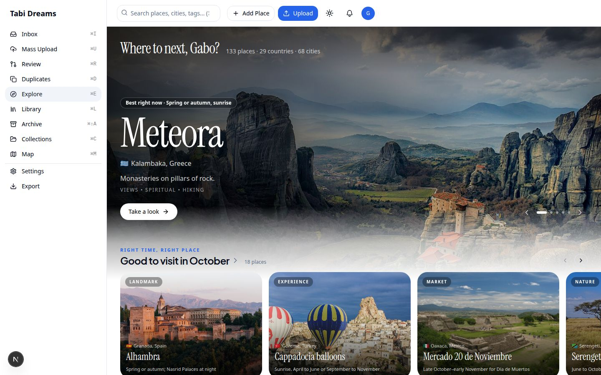 | Sidebar gains **Explore** (⌘E). The billboard hero shows today's pick and why it was picked; the first rail, "Right time, right place", sits over the hero's fading photo |
|  | 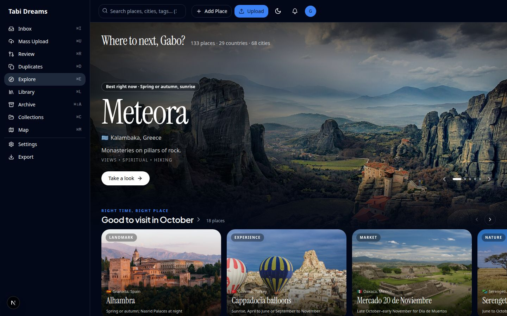 | `/explore` was a 404; the same home in dark mode |
|  | 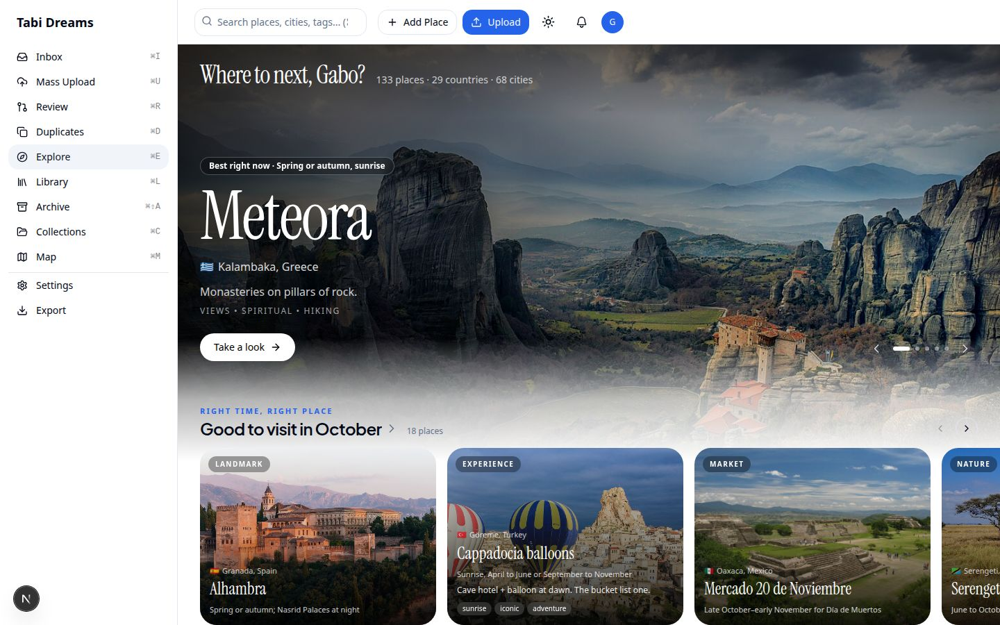 | Hovering a card slides up a details drawer (description, vibes; best time when the caption is not already the best time) |
|  | 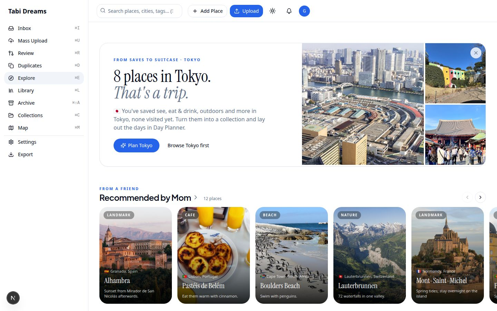 | "From saves to suitcase · Tokyo": 8 unvisited Tokyo saves become a trip |
|  | 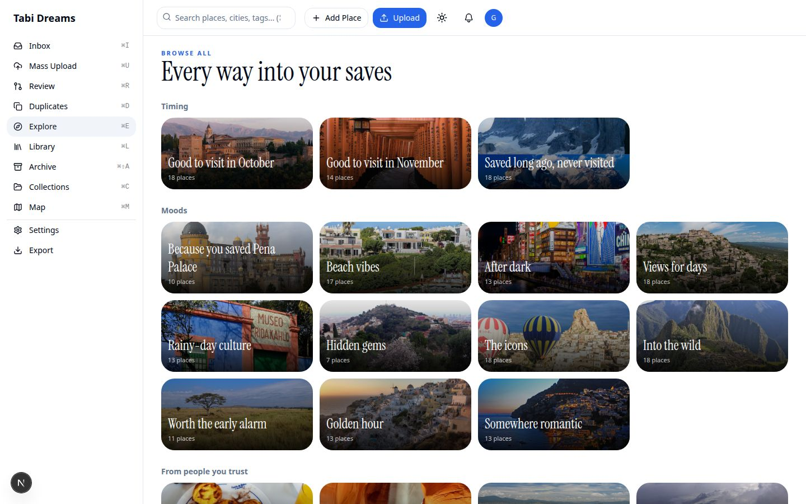 | Browse all: every rail the library supports, each with its own cover |
| 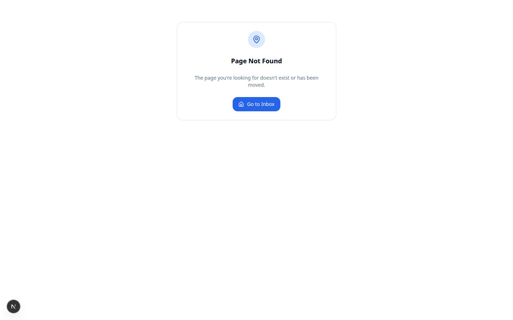 | 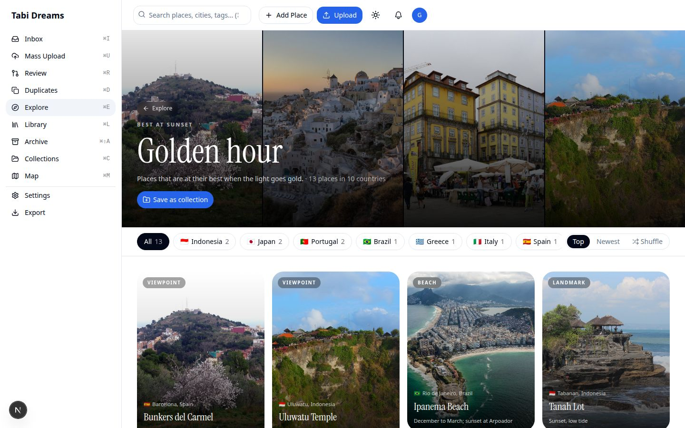 | Opened row: photo cover, Save as collection, country chips, Top / Newest / Shuffle |
|  | 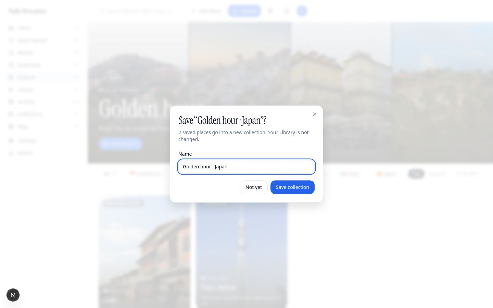 | Filtered to Japan, "Save these 2" names the collection before anything is written |
|  | 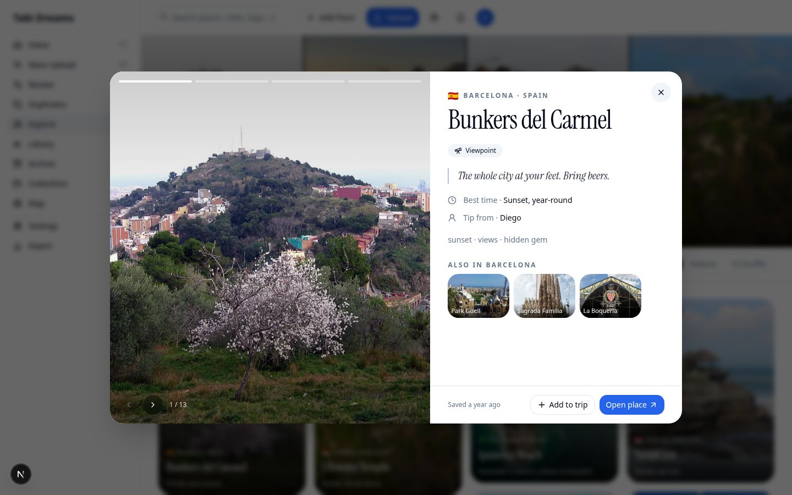 | Clicking a card opens the quick-look sheet, stepping through the row |
|  | 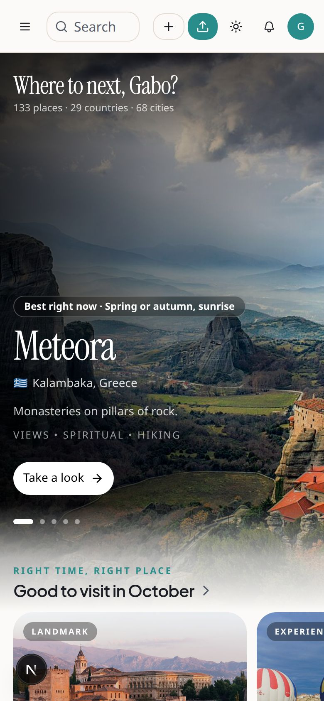 | Phone, tropical theme: home |
|  | 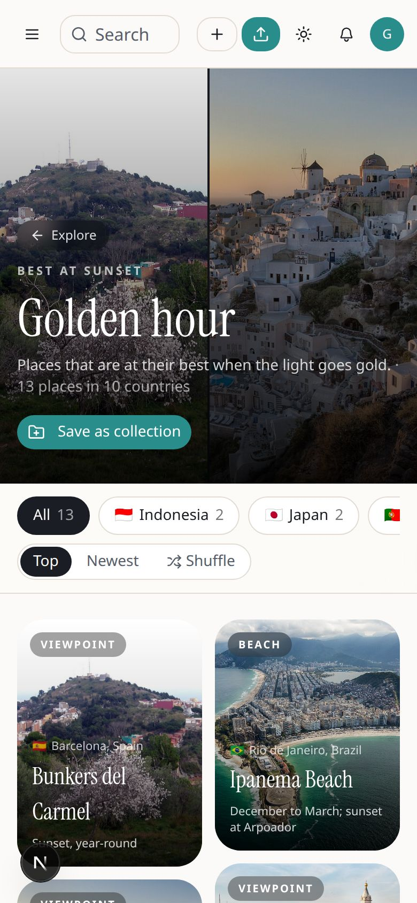 | Phone, tropical theme: opened row (no horizontal overflow, `scrollWidth` = 390) |

**Exercised live in the browser:** the home page top to bottom in classic light and dark and
in tropical on a phone; the hover drawer (Chrome started with a hover-capable pointer, since
headless Chrome otherwise reports `hover: none`); "Save these 2" on a Japan-filtered row,
which created a 2-place collection in the local database and opened it; "Plan Tokyo", which
created an 8-place collection and opened the existing Day Planner with all 8 unscheduled;
the quick-look sheet and its next/previous stepping.

**Covered by unit tests, not screenshotted:** home rail selection and cap, stable
"Because you saved" links, country chips and ordering, the five billboard picks, trip
moment kinds and the existing-collection branch, and cross-tenant isolation of the Explore
queries against a real SQLite file.

**Reasoned only:** behaviour with a production-sized library (the payload carries every
browsable place to the client provider).
