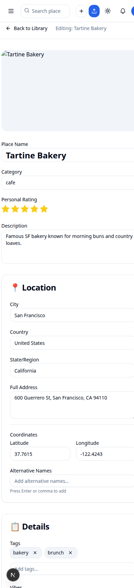
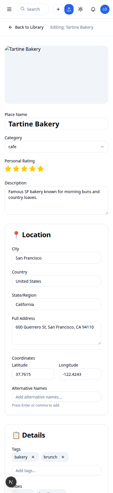
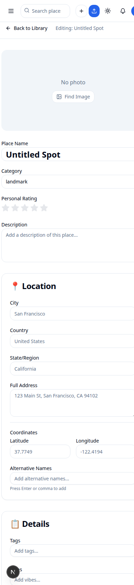
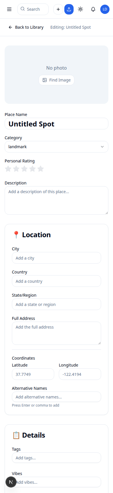
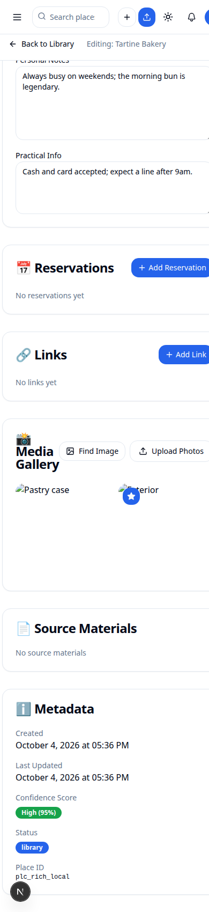
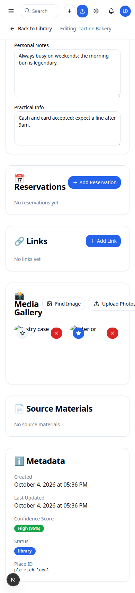
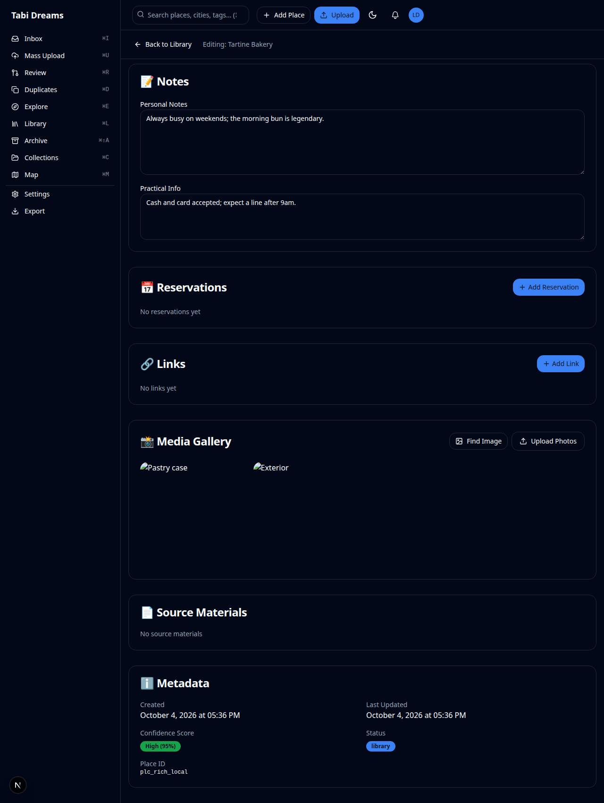

# Place view defects — first PR

Four place-page defects fixed on `/place/[id]` regardless of the Postcard
redesign the captain approved for a parallel branch. Captured against a
local libSQL dev DB via headless Chrome on `:9222` against `next dev` on
`:3010`, signed in as a test user that owns a rich place (Tartine Bakery)
and a sparse place (Untitled Spot).

The pipeline's two `no-mistakes(review)` fixes apply on top of these four:

- `b5dacaf` — `isPrimary ? "opacity-100" : ...` reinstates the always-visible
  filled-star badge on the cover photo on desktop, so the captain can still
  see at a glance which photo is the cover.
- `41c4d48` — replaces the `md` breakpoint gate with
  `[@media(hover:hover)]:opacity-0` + `[@media(hover:hover)]:group-hover:opacity-100`,
  so tablets and any coarse-pointer device (touch on ≥768px) keep the
  always-visible touch controls and only fine-pointer / hover-capable
  devices hide until hover.

## Before | After

| Defect | Before | After |
|--------|---------|-------|
| Mobile horizontal overflow (390px) — rich place |  |  |
| Placeholders that look like real data on sparse places (390px) |  |  |
| Touch photo cover / delete buttons visible without hover (390px) |  |  |
| Desktop cover badge unchanged (1280px) — preserved by `b5dacaf` | — |  |

## What each shot shows

- **Mobile overflow (rich)**: before, the `-m-6` wrapper pushed the right
  edge of cards past the 390px viewport and the layout's `overflow-hidden`
  clipped them. After, `-m-3 [contain:inline-size] sm:-m-6` keeps cards
  inside the viewport.
- **Sparse placeholders**: before, empty City / Country / State / Website /
  Phone / Email inputs displayed `San Francisco`, `United States`,
  `California`, `https://example.com`, `(555) 123-4567`, `info@example.com`
  — all confused for real data. After, all six inputs show `Add a city`,
  `Add a country`, `Add a state or region`, `Add a website`, `Add a phone
  number`, `Add an email`.
- **Touch photo controls**: before, on a 390px touch viewport the
  Set-as-cover and Delete buttons on non-primary tiles were
  `opacity-0 group-hover:opacity-100` and never appeared. After, they are
  `opacity-100 [@media(hover:hover)]:opacity-0
  [@media(hover:hover)]:group-hover:opacity-100`, so any touch device sees
  them.
- **Desktop cover badge**: after, the primary photo's filled-star badge
  stays at `opacity-100` on md+ viewports — unchanged from the original
  behavior, restored by `b5dacaf` after the first review round.

## Tab title (no image)

- Before: `Edit Tartine Bakery - Travel Dreams | Tabi Dreams`
- After: `Tartine Bakery - Travel Dreams | Tabi Dreams`