# Place page: "Postcard" view mode (step 2 of the redesign)

These are live captures from headless Chromium (`chrome-devtools-axi`, CDP `:9341`) against `next dev` on `:3301`. I was signed in as the local demo user (`explorer@local.test`) against a throwaway SQLite file seeded from the Explore prototype data, never production. Desktop captures are 1440×900 and mobile 390×844. **Before** is `main` at `a59f34c` with the same data.

There are two places:
- *Fushimi Inari-taisha* (rich): photos, note, description, hours, contact, links with titles, a reservation, and sources.
- *Bar Leone* (sparse): only the basics, as the upload pipeline leaves them.

## Before / after

| Before | After | What it shows |
|---|---|---|
| 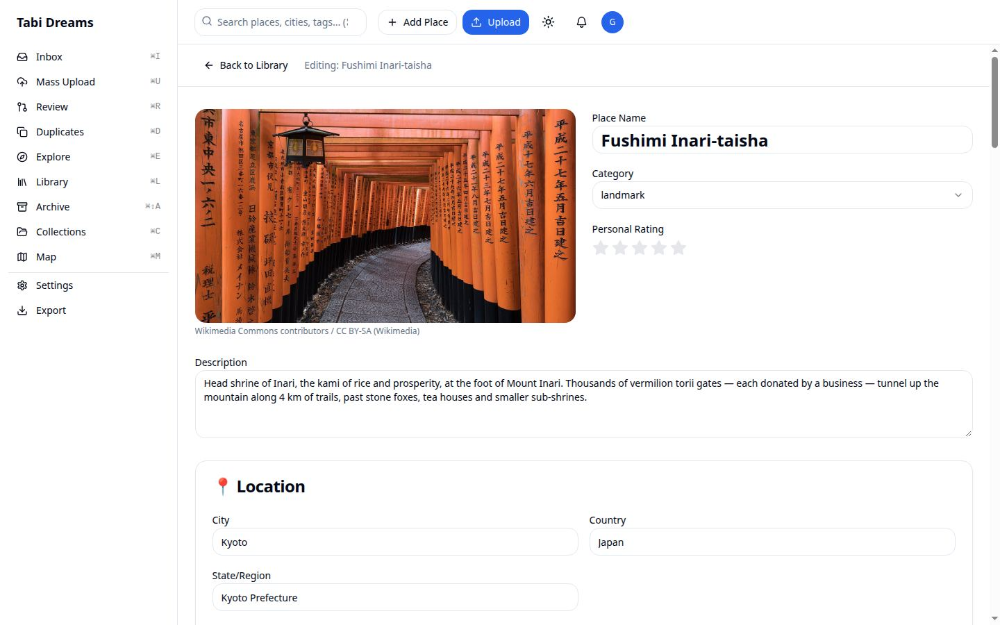 | 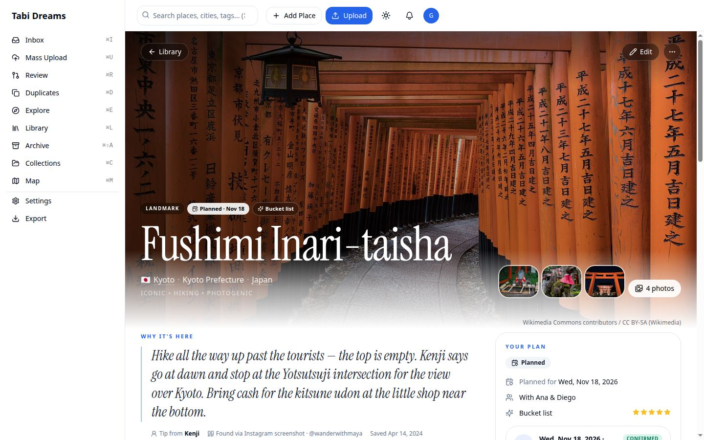 | The page opens in a read view: Explore's full-bleed hero, the serif name, the flag and Atlas links, and a sticky *Your plan* / *On the ground* rail. Before, it opened in a form already in edit mode. |
| 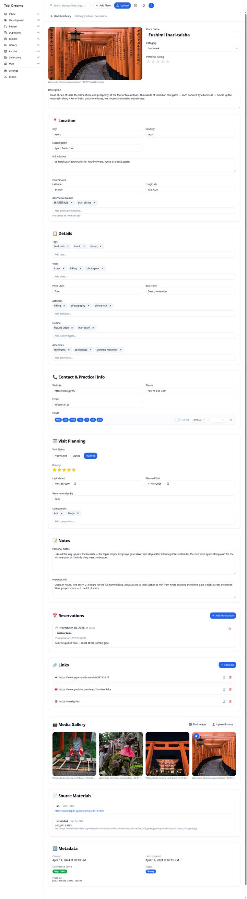 | 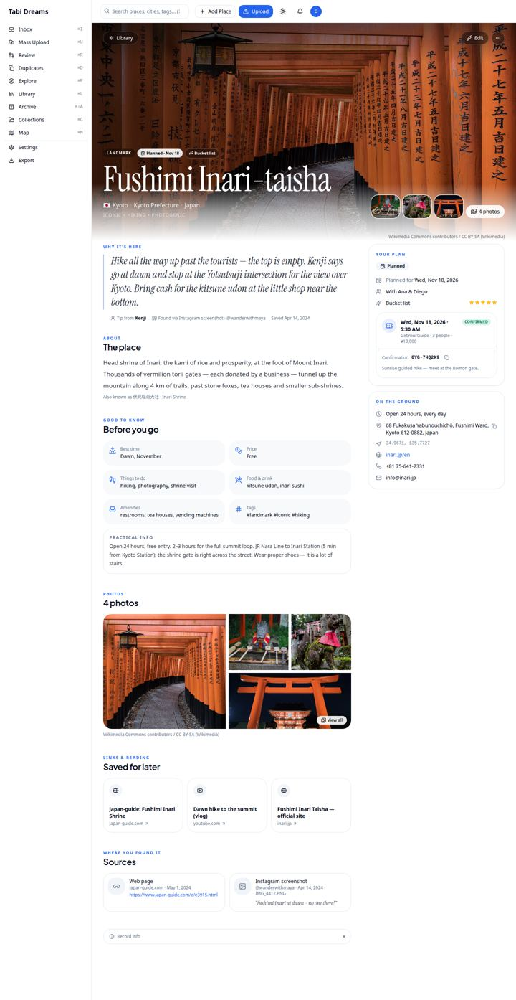 | The whole page. Before, it was eleven equal form cards, 5,221 px tall. After, it reads as quote → about → good to know → photos → links → sources → record info. |
| 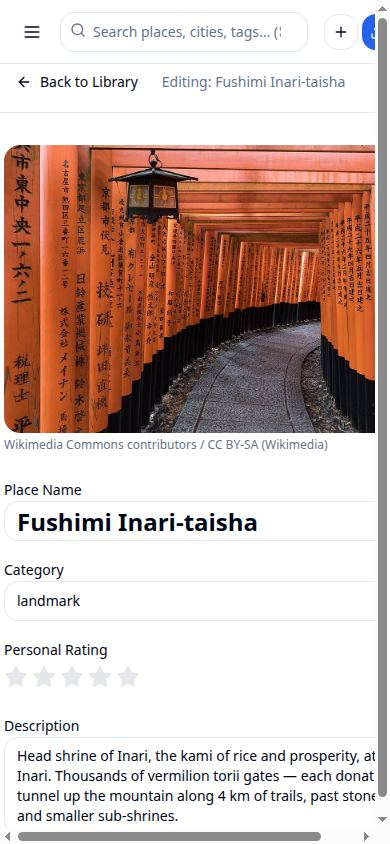 | 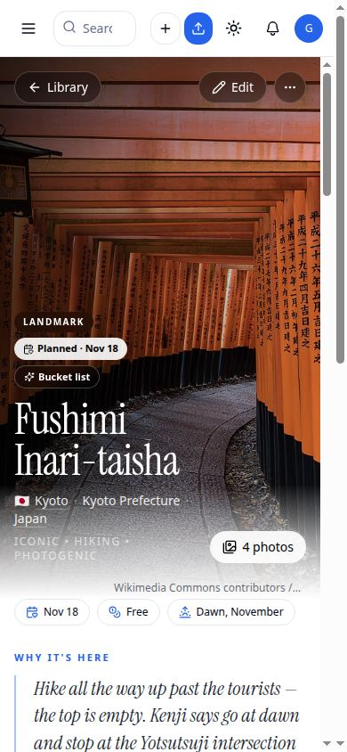 | Mobile: a hero, quick-fact chips and your note first. The view has no horizontal scroll (document 375/375 px). |
|  | 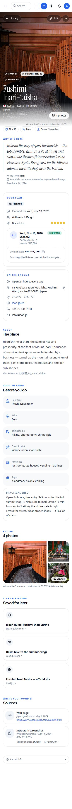 | Mobile, whole page. On small screens the rail sits right after the note. |
| 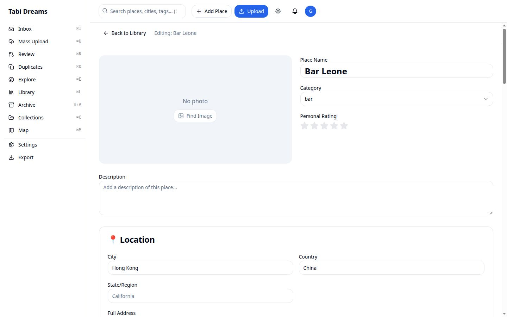 | 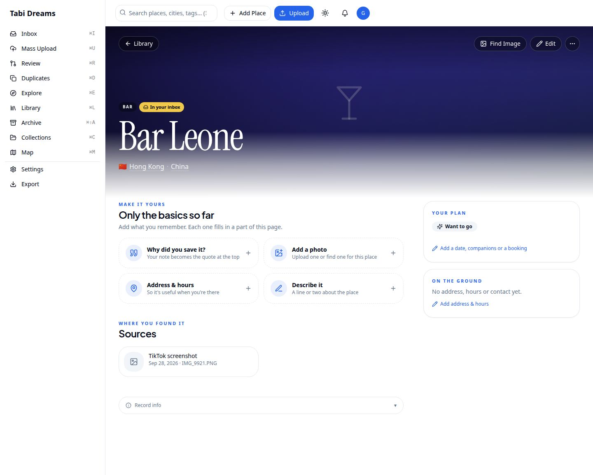 | A sparse place: empty sections don't render, and the missing pieces become "Make it yours" invitations that open the editor. The hero uses Explore's duotone fallback. |
| 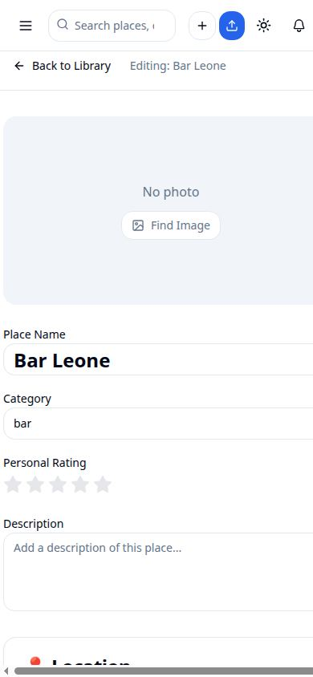 | 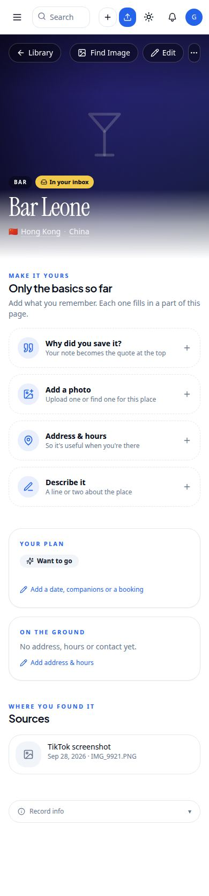 | The sparse place on mobile. |

## Editing and actions

| Capture | What it shows |
|---|---|
| 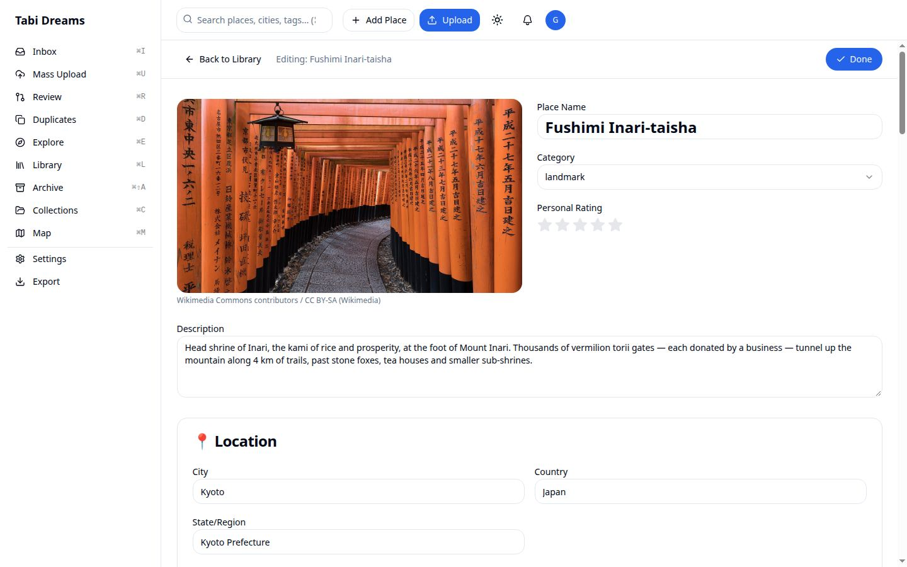 | **Edit** opens today's editor unchanged, with a new **Done** button. Done first sends any edit still inside the 800 ms autosave debounce, and stays in the editor if that save fails. |
| 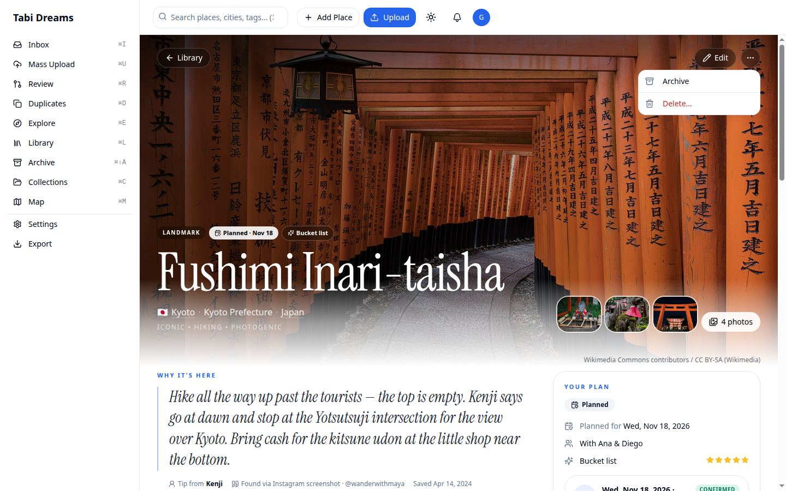 | The hero ⋯ menu: **Archive** and **Delete…** (on an archived place it shows **Restore to library**). |
| 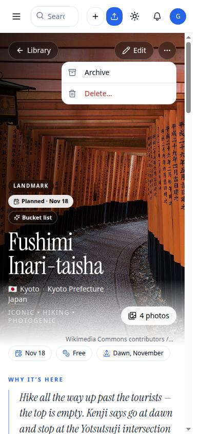 | The same menu on mobile. |
| 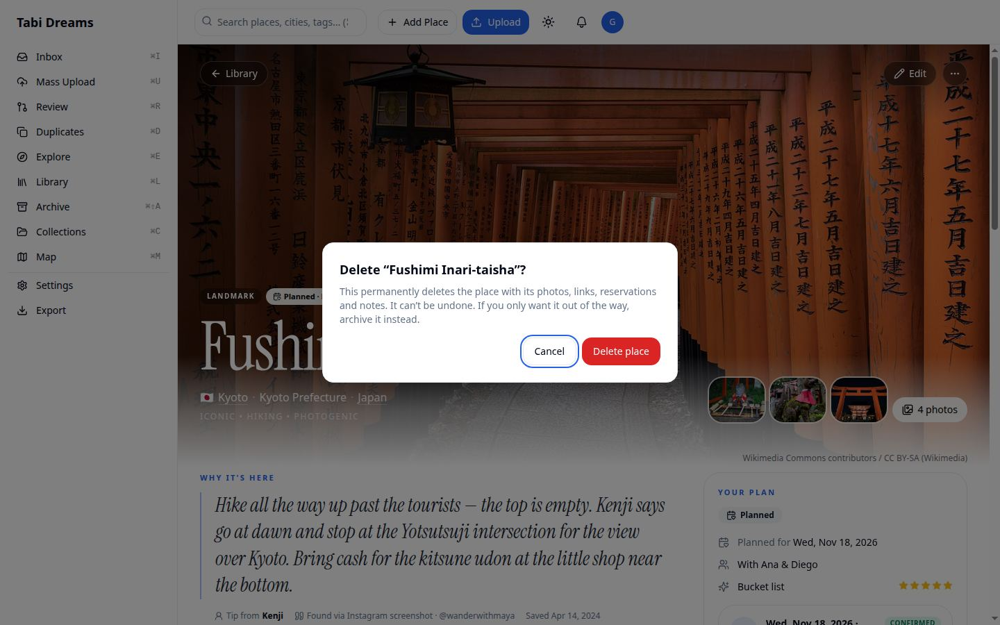 | Delete is behind a confirmation dialog that names the place and suggests archiving instead. |
| 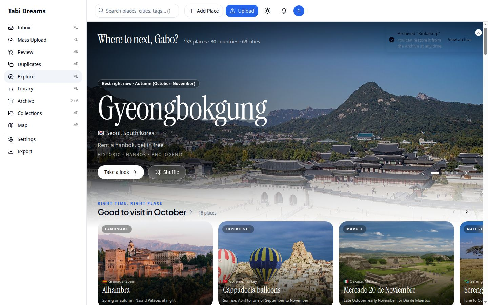 | After archiving from Explore → quick look → Open place, the user is back on Explore (refreshed, so the place is gone) and a toast offers **View archive**. |
| 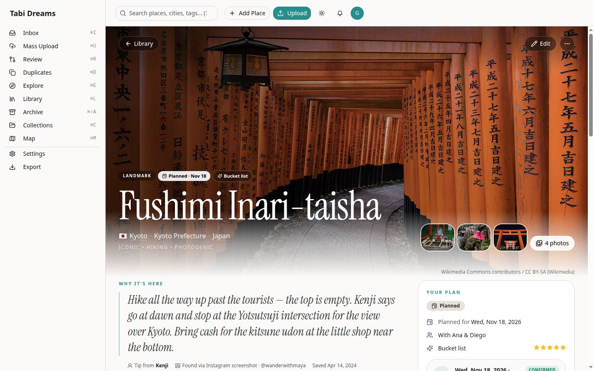 | The tropical theme. Everything uses the semantic tokens. |

**Exercised live in the browser:**
- Edit → change the description → Done straight away. That sent exactly one PATCH, the view showed the new text, and the "Describe it" invitation disappeared.
- Archive from Explore (returned to `/explore`, toast shown, row `status = archived`).
- Restore to library (row back to `library`, chip gone).
- Delete of a throwaway row (returned to the previous page, row removed).
- 390 px overflow check on both places.

**Covered by unit tests:**
- `src/__tests__/place-view/format.test.ts`: date-only formatting with no time-zone day shift, the hours summary (24h, grouped ranges, a closed-days list), link labels, http(s)-only hrefs, source descriptions, and the confidence thresholds.
- `src/__tests__/place-view/place-page.test.tsx`: opens in view mode; every stored field of a rich place appears; reservation fields; link titles with no `javascript:` href; cover photo first and the lightbox; Atlas links; the sparse invitations; Edit → Done.
- `src/__tests__/place-view/place-actions-menu.test.tsx`: archive and restore via `PATCH /api/places/[id]`, delete via `DELETE /api/places/[id]` only after confirmation, the failure path, and the back / Library fallback.
- `src/components/places/__tests__/place-full-view-save-status.test.tsx`: Done flushes a pending edit exactly once, stays put on failure, and leaves at once when nothing is pending.

## Inventory: every field and action on today's page, and where it is now

**View** is where it shows in the new read view. **Edit** means it's in the existing editor behind **Edit** (unchanged).

| Item | Before | Now |
|---|---|---|
| Back to Library | Header | Glass ← Library pill in the hero (editor keeps its own) |
| "Editing: {name}", save status, autosave | Header | Editor only (unchanged), plus **Done** |
| Primary photo + credit + Powered by Google | Boxed 16:9 | Full-bleed hero; credit under the hero; Google badge kept |
| Find image (no photo) | Empty photo box | Hero pill when there's no photo; also in the editor |
| name · kind · description | Inputs | View: hero title, kind pill, About. Edit |
| ratingSelf | Stars | View: *Your plan* → Your rating. Edit |
| city · admin · country | Inputs | View: hero line (city and country link to the Atlas). Edit |
| address · coords | Inputs | View: *On the ground* (address with copy, coordinates). Edit |
| altNames | Tag input | View: About → "Also known as". Edit |
| tags · vibes | Tag inputs | View: Good to know (#tags), hero vibes line. Edit |
| price_level · best_time · activities · cuisine · amenities | Inputs | View: Good to know cells + mobile quick facts. Edit |
| website · phone · email | Inputs | View: *On the ground* (website link, `tel:`, `mailto:`). Edit |
| hours | Hours editor | View: *On the ground* summary ("Open 24 hours, every day" / grouped days, expandable). Edit |
| visitStatus · priority · plannedVisit · lastVisited | Planning card | View: *Your plan* + hero chips. Edit |
| recommendedBy · companions | Planning card | View: "Tip from …" under the note; "With … & …". Edit |
| notes | Textarea | View: the "Why it's here" quote. Edit |
| practicalInfo | Textarea | View: Good to know → Practical info. Edit |
| Reservations: date, time, platform, confirmation, notes | Cards | View: ticket in *Your plan* (copyable confirmation). Add/delete in Edit |
| Reservation party size, total cost, status, booking URL, special requests | **Stored, never shown** | View: **now on the ticket** |
| Links: list, open | Raw URLs | View: cards with the **stored title** + domain. Add/delete in Edit |
| Photos: gallery, lightbox | 9th card | View: Photos mosaic + View all → the same lightbox. Cover/delete/upload/find in Edit |
| Sources: type, date, filename, URL | Card | View: "Where you found it" (platform, author, OCR line); storage path → Record info |
| created · updated · confidence · status · ID | Card | View: Record info (collapsed) |
| Archive / Delete | *Not on the page* | **New**: hero ⋯ menu (existing endpoints). Restore on archived places |

The editor still shows every field, including the empty ones. Out of scope here and coming in later PRs: section pencils, the "open in edit mode" setting and `?edit=1`, reservation editing and an "Open 24 hours" hours option (step 3); trips + Add to trip, map / Directions / Call, and *Also in {city}* (step 4).
