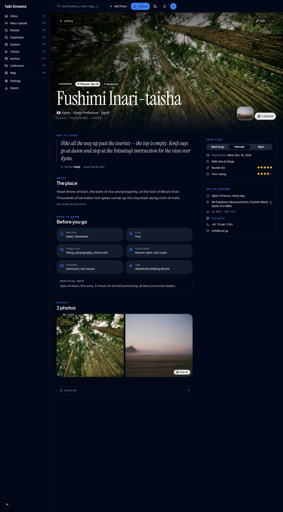
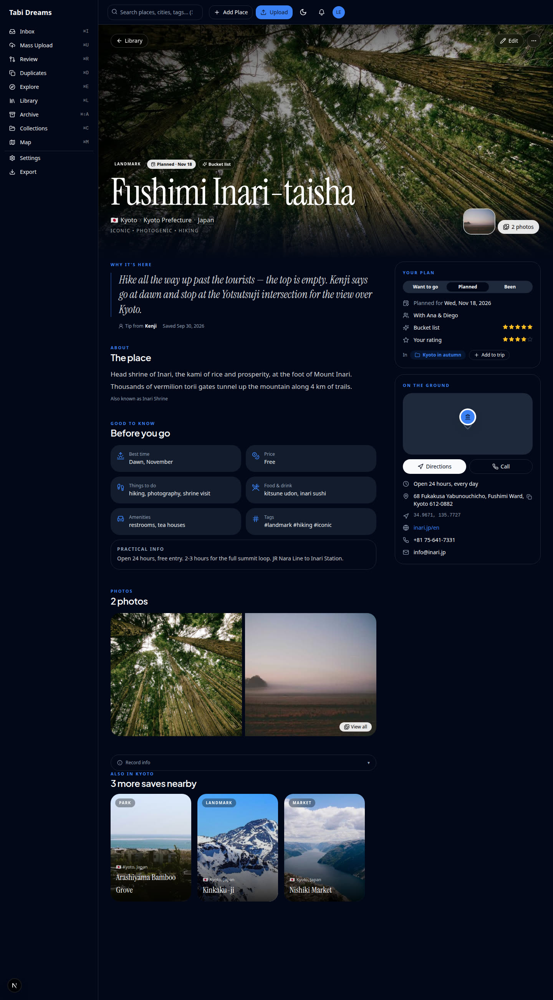
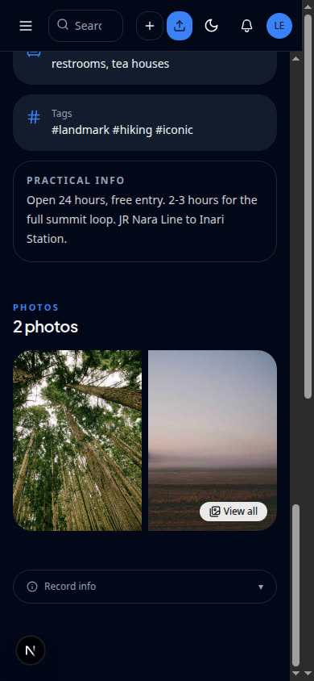
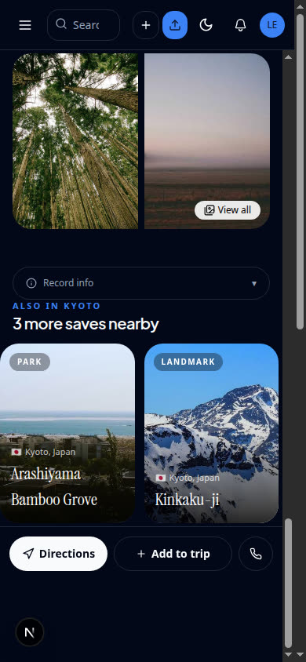
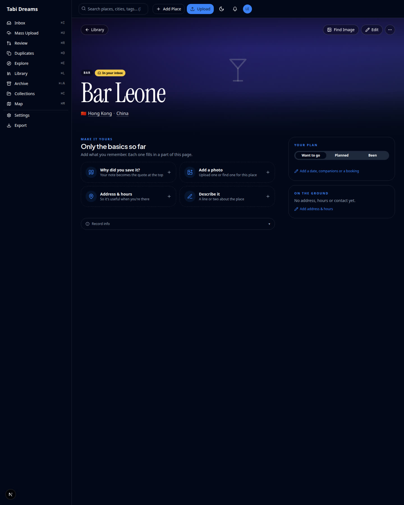
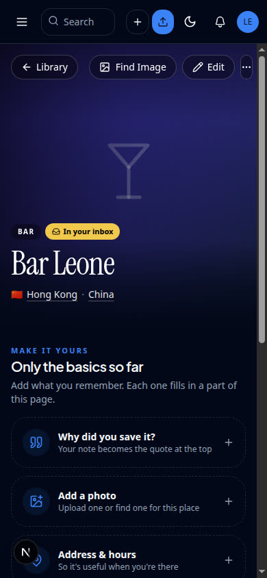
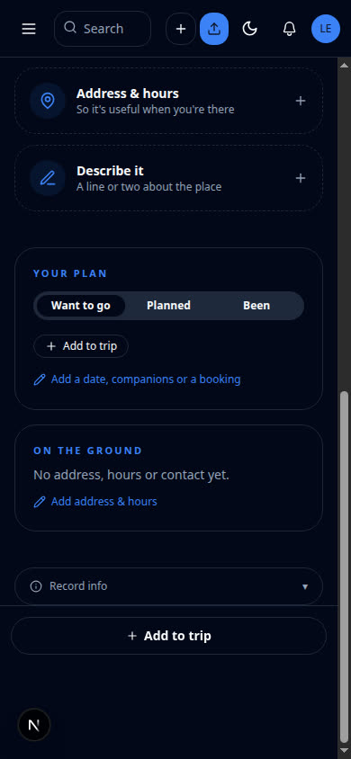
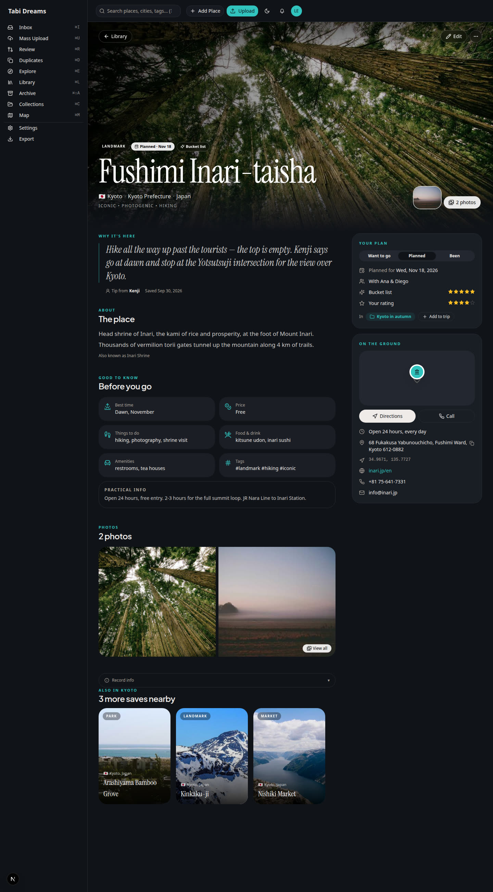

# Place page: additions — trips, map & *Also in {city}* (step 4 of the redesign)

Live captures from headless Chromium (`chrome-devtools-axi`, CDP `:9333`) against `next dev` on `:3301`, signed in as the local demo user (`explorer@local.test`) against a throwaway SQLite file seeded from the repo migrations, never production. **Before** is the Postcard view at `09ffdc1` (PR #51) with the same data; **After** is this change.

Two places:

- *Fushimi Inari-taisha* (rich): coordinates, phone, hours, a trip membership, and three same-city neighbours.
- *Bar Leone* (sparse): only the basics — no coordinates, no phone, no neighbours.

Desktop captures are the full page (1440 wide, tall viewport); mobile captures are 390×844 scrolled to the bottom so the sticky action bar is visible.

## Before / after

| Before | After | What it shows |
|---|---|---|
|  |  | **Trips in *Your plan***: the place's trips ("In · Kyoto in autumn") and an **Add to trip** button. **Map + Directions + Call in *On the ground***: a pinned map, a Directions button (opens Google Maps) and a Call button (`tel:`), above the existing address/hours/contact rows. **Also in Kyoto** rail of Explore poster tiles at the bottom. |
|  |  | **Mobile sticky bottom bar**: Directions · Add to trip · Call. Plus the *Also in Kyoto* rail above it. |
|  |  | **Graceful absence**: no map, Directions or Call when there are no coordinates/phone; **Add to trip** still works. No *Also in {city}* rail when there are no neighbours. |
|  |  | The sparse place on mobile — the bar shows only what the place can actually do. |

## Details

- **Map**: a static Mapbox image (`light-v11`) built from the app's existing `NEXT_PUBLIC_MAPBOX_TOKEN`, with the place's kind icon as the pin. No token → a muted placeholder with the pin, so the card keeps its shape and never loads a broken tile. There are no coordinates at all → the map is absent.
- **Directions**: `https://www.google.com/maps/dir/?api=1&destination=<lat>,<lon>` in a new tab, so mobile hands off to the maps app.
- **Call**: `tel:<phone>`, digits normalised the same way the existing phone row does.
- **Trips**: `getPlaceWithRelations` now loads the place's collections via `forUser` (`getCollectionsForPlace`), and the page loads the full trip list via `getExploreCollections` so **Add to trip** can mark the trips it's already in and offer the rest plus *New trip with this place*. All writes reuse the existing `POST /api/collections/[id]/places` and `POST /api/collections` endpoints.
- ***Also in {city}***: `getExplorePlacesInCity` (also via `forUser`) returns the user's other browsable places in the same city and country, primary photo first, reusing Explore's `PlaceTile` poster shape. Hidden when empty.

Both themes render: every new element uses only the semantic tokens (`text-primary`, `bg-primary/10`, `bg-foreground`, `bg-muted`, …), so classic and tropical both show the additions without change.

| Capture | What it shows |
|---|---|
|  | The rich place in the **tropical** theme — the trips pill, Directions / Call and *Also in Kyoto* rail pick up the theme's tokens. |

## Exercised live in the browser

- Rich place (1440 and 390): trips pill and **Add to trip** in *Your plan*; map, **Directions** and **Call** in *On the ground*; the *Also in Kyoto* rail; the mobile bar with all three actions.
- Sparse place (1440 and 390): no map / Directions / Call, no rail, but **Add to trip** present.
- **Add to trip** → chose an existing trip: the collection API was called and the trips pill updated after refresh (covered by `place-additions.test.tsx`).

## Covered by tests

- `src/__tests__/authorization/place-collections-ownership.test.ts`: `getCollectionsForPlace` and `getExplorePlacesInCity` run against a real SQLite fixture — a place's trips never leak across tenants, and a same-named city in another country never merges.
- `src/__tests__/place-view/place-additions.test.tsx`: the trips pill, Add-to-trip (add + new-trip) against the collection endpoints — including a `207` partial failure counted as a failure, and a half-built new trip retried into the same trip from either menu, forgotten once the place lands in it or the trip is deleted — the map / Directions / Call targets, the mobile bar, the *Also in {city}* rail, and the sparse fallback.
